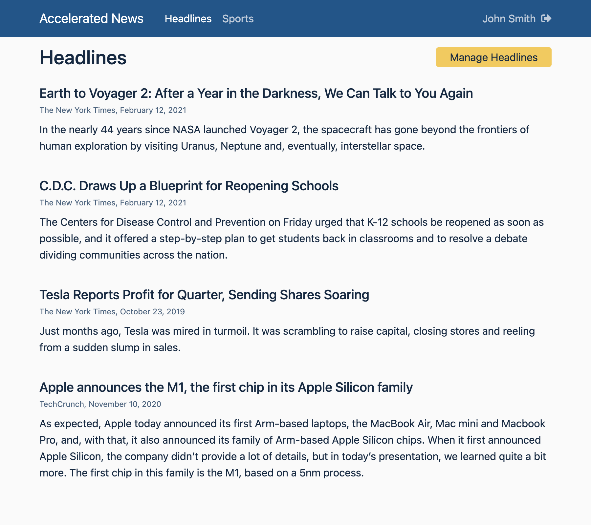

# Accelerated News

This project was bootstrapped with
[React Accelerate](https://github.com/PublicisSapient/cra-template-accelerate).
It demonstrates how one could build upon the foundation provided by React
Accelerate. Specifically, this is an example of a simple News site with some
content that is available publicly, while other content that is only available
to authenticated users.



## React Accelerate Features

1. TypeScript based - for type safety
2. [Opinionated folder structure](docs/folder-structure.md)
3. Foundational libraries
   - [React Router](https://reactrouter.com/)
4. Essential tools
   - [Storybook](https://storybook.js.org/) to develop UI components in
     isolation
   - [React Testing Library](https://testing-library.com/) for unit testing
   - [Cypress](https://www.cypress.io/) for end-to-end testing
   - [Husky](https://typicode.github.io/husky) to improve the quality of commits
   - [Mock Service Worker](https://mswjs.io/) to mock HTTP requests
   - [Prettier](https://prettier.io/) to format code consistently
5. Some useful starter components:
   - **ErrorBoundary**: A component to catch JavaScript errors anywhere in its
     child component tree and display a fallback UI.
   - **Loading**: A placeholder loading component
   - **EnvProvider**: Provides a mechanism for loading environment variables
     dynamically by placing an environment file (`env.js`) in the `/public`
     folder. This allows a single build to be used across multiple environments
     such as develop, qa, uat & prod.
   - **Home**: A simple page showing end-to-end flow from client to server. It
     makes an HTTP request to the server, which is intercepted by Mock Service
     Worker (in development mode) and displays a list of movies. The unit test
     for this page does not have to do any jest level mocking, demonstrating the
     power of MSW.
   - **NotFound**: A placeholder NotFound page
   - **Sample Storybook Stories**: Showing best practices in Storybook
   - **Unit Testing**: Utility functions to make testing easier. Also, some
     sample tests to show best practices.
   - **End-to-End Testing**: Sample Cypress tests to show best practices.

## Implementation decisions made in this example

1. For this example, we have chosen to use pure CSS and CSS Variables to
   implement a simple design system. We have used
   [Chota](https://jenil.github.io/chota/), a lightweight CSS framework, to get
   us started with some foundational styles. Obviously you can use any other
   styling framework in your own apps.
2. We have used [BEM](https://en.bem.info/) to properly namespace our styles. Of
   course, this is not needed if you use more modern techniques like CSS Modules
   or CSS-in-JS. However, it is always good to know the classic CSS techniques.
3. We have enhanced the starter components provided by React Accelerate and
   provided a few more. See inside the `/src/components` folder. You can get a
   better feel for these components in the project's Storybook.
4. We added a _Style Guide_ section to our Storybook to show how documentation
   can be added using the Markdown syntax. For more information see the
   [Storybook documentation](https://storybook.js.org/docs/react/api/mdx).
5. We are using REST for communicating with the server. Specifically we are
   using an [axios](https://github.com/axios/axios) based HTTP client. We use an
   [axios interceptor](https://github.com/axios/axios#interceptors) to simplify
   calling the server APIs. Of course, we are still leveraging Mock Service
   Worker (MSW) for local development.
6. We are using [React Query](https://react-query.tanstack.com/) to manage
   server state. You can find introductory videos on React Query
   [here](https://react-query.tanstack.com/videos).
7. We have added token-based authentication to the application.
   - Users can sign up by supplying some basic information.
   - Once signed up, they can sign in using their credentials. If the
     credentials match, the server returns a unique access token to the
     front-end.
   - The front-end saves the access token in localStorage and returns it to the
     server in every HTTP request. The server uses this token to identify the
     user making the request.
   - When the user signs out, the access token is deleted from localStorage.
8. Authenticated users can add, update or delete news headlines on the Manage
   Headlines page. Access to this page is granted only to authenticated users.
   This is implemented using a `PrivateRoute` component, which extends react
   router's `Route` component.
9. _Manage Headlines_ page demonstrates the use of the Master-Detail pattern to
   add or edit headlines.

## Getting Started

Make sure your development machine is set up for building React apps. See the
recommended setup procedure [here](docs/dev-machine-setup.md).

Execute the following commands to install dependencies:

```sh
# note: "--legacy-peer-deps" option is required for npm version > v7
# see details here: https://github.com/storybookjs/storybook/issues/12983
npm install --legacy-peer-deps option
```

Now execute the following commands to run the app:

```sh
npm start
```

Now point your browser to http://localhost:3000/.

## Running Storybook

Storybook is a powerful tool for developing UI components in isolation,
independent of the final app they will be deployed in. This approach has the
following benefits:

1. Develop components without needing to build entire screens, fuss with data or
   business logic
2. Render components in key states that are tricky to reproduce in an app
3. Document components with examples and properties

React Accelerate comes ready with Storybook. Execute the following command to
run Storybook.

```sh
npm run storybook
```

## Running Unit Tests

React Accelerate comes ready with Jest and React Testing Library to run unit
tests. Execute one of the following command to run unit tests.

```sh
npm run test # interactive mode
npm run test:coverage # non-interactive mode with coverage information
```

Note that unit tests are automatically executed when you commit code to your
local repo. This ensures that you are not committing broken code.

## Running End-to-End Tests

React Accelerate comes ready with Cypress to run end-to-end tests. Execute
Cypress using the following commands:

```sh
npm start # starts a local server hosting your react app

# run cypress in a different shell
npm run cypress:open
```

## Code Formatting

React Accelerate uses Prettier to consistently and easily format code. Prettier
is an opinionated code formatter that provides the following benefits:

1. Code is formatted automatically without any fuss
2. There is no need to discuss style in code review
3. Saves you time and energy

Prettier is automatically executed when you commit code to your local repo. You
can also execute it manually using the following command:

```sh
npm run format
```

## Learn More

- [React Accelerate Documentation](docs)
- [Create React App documentation](https://facebook.github.io/create-react-app/docs/getting-started)
- [React documentation](https://reactjs.org/)
- [How to know what to test](https://kentcdodds.com/blog/how-to-know-what-to-test)
- [Write tests. Not too many. Mostly integration.](https://kentcdodds.com/blog/write-tests)
- [State Colocation - Where to Put State](https://kentcdodds.com/blog/state-colocation-will-make-your-react-app-faster)
- [How to use React Context effectively](https://kentcdodds.com/blog/how-to-use-react-context-effectively)
- [MindBEMding – getting your head ’round BEM syntax](https://csswizardry.com/2013/01/mindbemding-getting-your-head-round-bem-syntax/)
- [Get BEM - Naming](http://getbem.com/naming/)
- [Learn CSS Variables in 5 minutes](https://www.freecodecamp.org/news/learn-css-variables-in-5-minutes-80cf63b4025d/)
- [Difference between CSS variables and preprocessor variables](https://css-tricks.com/difference-between-types-of-css-variables/)
- [CSS Variables - Lea Verou](https://www.youtube.com/watch?v=2an6-WVPuJU)
